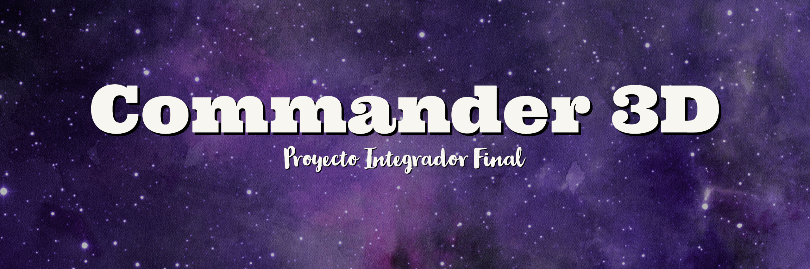

Para este proyecto decidí realizar una pagina web de venta de figuras en 3D
hechas con dos modelos distintos de impresoras.

# __Tecnologias usadas para esta pagina__

 __JavaScrip - HTML - CSS - Bootstrap - Swiper__

# __Como se penso la pagina__

Lo primero fue la idea. De que se trataria esta pagina. Una pagina que se pueda modificar con las demas etapas de la carrera.

Teniendo eso en mente, el siguiente paso fue pensar en algo util que no solo sea un proyecto para la carrera, sino que me sirva en terminos personales.

Imagine una pagina que muestre figuras impresas en 3D hechas por mi y mi compañero.

- Para esto decidi que sea lo mas modular posible utilizando solo HTML y CSS para que al trabajar en ella pueda tener facilidades de todo tipo a la hora de buscar y modificar codigo.

## __Luego pense el diseño para pantallas de escritorio.__ <em> (Sabiendo que no era lo ideal)</em>

- Lo primero que se hizo fue un header con una navegacion simple.

- El siguiente paso fue una seccion para mostrar una pequeña diferencia entre las dos tecnologias de impresion.
    - Para esto se uso el display flex, en varias clases

- Otra de las secciones era un carrusel para mostrar algunas de las figuras.
    Para lograr este carrusel use la libreria de swiper y otra de ionicons para los iconos de flecha bajo el carrusel, que despues servirian para
    hacer un poco de magia con JavaScrip y que sirvan como boton para los cambios de imagenes.
    Tambien hice un boton para ver mas productos. En esta instancia no hace nada pero que mas adelante servira para mostrar una galaeria de imagen
    de productos, la cual voy a hacer utilizando JavaScript
    - Tambien use display flex

- Por ultimo hice el footer, donde coloque como titulo el nombre de la pagina y una breve informacion sobre los pedidos.
    
    Use una de las tarjetas hechas en una pactica que me gusto mucho, a la cual le di mi propio estilo y rellene con mis datos personales
    y tambien agregue una tarjeta para mi compañero, por que mi idea es usar esta pagina para que las personas vean nuestro trabajo.
    
    Agregue unos botones para las redes sociales y contactos de cada uno <em> (Solo las mias contienen datos, decidi no poner las de mi compañero por privacidad). </em>
 
    - para todo esto se uso display flex y flex direction.

- Como ultimo detalle agregue los derechos de autor bajo el footer

# __Implementación SASS__

Se quito todo el CSS nativo y se implemento el uso de SASS

# __Implementación JavaScript__

- Se realizo un carrusel con JavaScript y la libreria Swipper (https://swiperjs.com/get-started).
- Implementacion de 3 galerias para mostrar los productos.
     
     - Se uso la libreria lightgallery (https://www.lightgalleryjs.com/) para mostrar las imagen mas grandes al darle click con varias funciones extras:
     
     - (Zoom, Descargar, Presentar, Expandir, entre otros),, tambien muestra el precio y nombre de cada figura.

- Se crearon efectos de aparicion al hacer scroll hacia abajo con otra libreria llamada Scroll Reveal (https://scrollrevealjs.org/)
- Se creo una nav desplegable, la cual se esconde cuado se hace scroll hacia abajo y se muestra haciendo scroll hacia arriba.
    
    - Se implemento con una funcion y un evento que se le aplican a los estilos.

- Una implementacion muy util fue el modo oscuro, tambien llamado Dark mode.
     
     - Se creo con una funcion y un evento agregando clases al usar el evento click en un boton.
